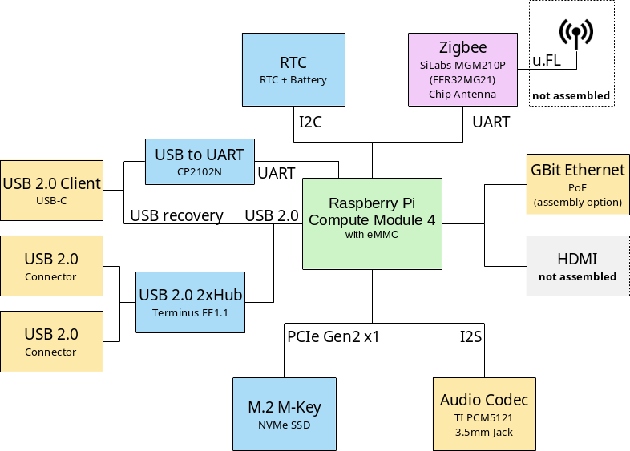

# Home Assistant Yellow

This repository contains the PCB design files of the Home Assistant Yellow.
The design has been made using the open source design software KiCad 6.0.
The project got successfully crowd funded on [Crowd
Supply](https://www.crowdsupply.com/nabu-casa/home-assistant-yellow) in
October 2021. Home Assistant Yellow continous to be available. For updated
information on availability check
[yellow.home-assistant.io](https://yellow.home-assistant.io/).

## Overview

Home Assistant Yellow is a custom PCB and requires a Raspberry Pi Compute
Module 4 (CM4) to be able to run. The PCB is design to run Home Assistant
(using Home Assistant OS).

The main features are:

- Raspberry Pi Compute Module 4 (CM4) board-to-board connector
- Silicon Labs MGM210P 802.15.4 capable radio module
- M.2 slot with PCIe x1 connected to the CM4 (e.g. for NVMe storage)
- 12V DC power input
- Gigabit Ethernet with assembly option for PoE+
- USB 2.0 Hub
- TI Audio DAC
- CP2102N bulit-in USB-to-UART converter for serial console

More information about Home Assistant Yellow can be found at
[yellow.home-assistant.io](https://yellow.home-assistant.io/).

### System Design Overview

